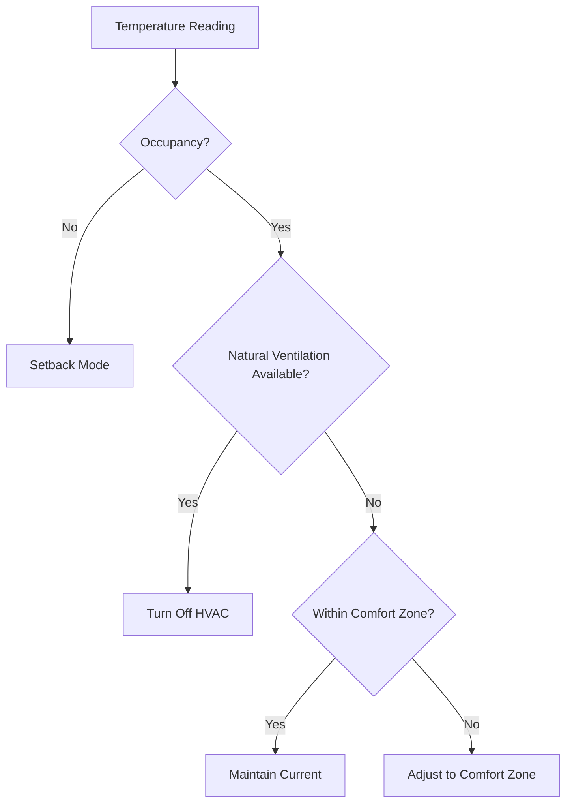

# 🌡️ Adaptive Climate Blueprint

[](https://www.home-assistant.io/)
[](https://www.ashrae.org/technical-resources/bookstore/standard-55-thermal-environmental-conditions-for-human-occupancy)
[](https://opensource.org/licenses/MIT)

**Intelligent climate control blueprints for Home Assistant implementing ASHRAE 55 adaptive comfort model with energy optimization.**

## 🚀 Features

- **🎯 Adaptive Comfort**: Dynamic comfort zones based on outdoor temperature
- **📊 ASHRAE 55 Compliance**: Implements adaptive thermal comfort model
- **⚡ Energy Optimization**: 15-30% energy savings through intelligent control
- **🏠 SmartIR Compatible**: Works seamlessly with existing SmartIR setups
- **🌬️ Natural Ventilation**: Automatic detection of free cooling opportunities
- **👥 Occupancy Aware**: Adjusts operation based on room occupancy
- **📱 Easy Configuration**: User-friendly blueprint interface

## 📋 Quick Start

### Prerequisites

- Home Assistant Core 2023.4+
- Temperature sensors (indoor and outdoor)
- Climate entities (SmartIR, generic thermostat, etc.)
- Optional: Occupancy sensors

### Installation

1. **Import Blueprint**
   ```
   https://github.com/msinhore/adaptive-climate-blueprint/blob/main/blueprints/ashrae55_adaptive_comfort.yaml
   ```

2. **Configure Automation**
   - Go to Settings → Automations & Scenes → Blueprints
   - Click "Create Automation" on the ASHRAE 55 blueprint
   - Configure your sensors and preferences

3. **Start Saving Energy! 🎉**

## 🔧 Blueprint Configuration

### Required Inputs (Minimum Setup)
- **Climate Entity**: Your AC/heating device (SmartIR, etc.)
- **Indoor Temperature Sensor**: Room sensor, weather service, or input number  
- **Outdoor Temperature Sensor**: Weather service, physical sensor, or input number

### Optional Advanced Inputs
- **Occupancy Sensor**: Motion or presence detector (energy savings)
- **Mean Radiant Temperature Sensor**: Wall temperature sensor or input number (operative temperature)
- **Indoor Humidity Sensor**: Room humidity sensor or input number (humidity corrections)
- **Outdoor Humidity Sensor**: External humidity sensor, weather service, or input number (natural ventilation)
- **Air Velocity Settings**: Fan speed control and cooling effects

> **💡 Pro Tip**: Start with the basic 3-sensor setup - it works perfectly! Add advanced sensors later for enhanced precision and energy savings.

### Configuration Approaches

#### 🚀 **Quick Start (Basic Setup)**
```yaml
# Only 3 sensors needed - full ASHRAE 55 compliance!
climate_entity: climate.your_ac
indoor_temp_sensor: sensor.room_temperature
outdoor_temp_sensor: weather.openweathermap        # Weather service (recommended)
comfort_category: "II"  # ±3°C tolerance
```

#### 🌤️ **Weather Service Options**
```yaml
# Use integrated weather services (no outdoor hardware needed!)
outdoor_temp_sensor: weather.openweathermap        # OpenWeatherMap
outdoor_temp_sensor: weather.open_meteo           # Open-Meteo (no API key)
outdoor_temp_sensor: weather.met                  # Met.no
outdoor_temp_sensor: sensor.outdoor_temperature   # Physical sensor
```

#### 🎛️ **Manual Control Options**
```yaml
# Use input numbers for manual override or testing
outdoor_temp_sensor: input_number.outdoor_temp_override     # Manual control
indoor_temp_sensor: input_number.room_temp_calibrated      # Calibrated sensor
mean_radiant_temp_sensor: input_number.wall_temperature    # Manual wall temp
```

#### 🎯 **Advanced Setup (Maximum Precision)**
```yaml
# Add optional sensors for enhanced features
mean_radiant_temp_sensor: sensor.wall_temperature    # Operative temperature
indoor_humidity_sensor: sensor.room_humidity         # Humidity corrections  
occupancy_sensor: binary_sensor.room_motion         # Energy savings
use_operative_temperature: true                      # Enable advanced features
comfort_precision_mode: true                        # CBE tool accuracy
```

📖 **Configuration Guides:**
- **[Complete Setup Guide](docs/basic-vs-advanced-setup.md)** - Detailed configuration options
- **[Weather Services Setup](examples/weather-services-setup.md)** - Using weather integrations

### Additional Settings
- **Comfort Category**: ASHRAE 55 categories (I, II, III)
- **Energy Save Mode**: Enhanced efficiency features
- **Natural Ventilation**: Free cooling optimization

## 📊 How It Works

### ASHRAE 55 Adaptive Model

The blueprint calculates adaptive comfort zones based on outdoor temperature:

```
Comfort Temperature = 18.9 + 0.255 × T_outdoor
```

Where comfort zones adjust dynamically:
- **Category I**: ±2°C (90% satisfaction)
- **Category II**: ±3°C (80% satisfaction) 
- **Category III**: ±4°C (65% satisfaction)

### Energy Optimization Logic



## 🏠 SmartIR Integration Example

Perfect integration with existing SmartIR configurations:

```yaml
# Your existing SmartIR setup
climate:
  - platform: smartir
    name: Bedroom AC
    unique_id: bedroom_ac
    device_code: 1383
    controller_data: remote.broadlink_bedroom
    temperature_sensor: sensor.bedroom_temperature

# Add the blueprint automation
automation:
  - alias: "Smart Climate - Bedroom"
    use_blueprint:
      path: ashrae55_adaptive_comfort.yaml
      input:
        climate_entity: climate.bedroom_ac
        indoor_temp_sensor: sensor.bedroom_temperature
        outdoor_temp_sensor: sensor.outdoor_temperature
        occupancy_sensor: binary_sensor.bedroom_motion
        comfort_category: "II"
```

## 📈 Expected Benefits

| Feature | Traditional Thermostat | Adaptive Climate Blueprint |
|---------|----------------------|---------------------------|
| **Energy Savings** | Baseline | **15-30% reduction** |
| **Comfort Optimization** | Fixed setpoints | **Dynamic comfort zones** |
| **Natural Ventilation** | Manual | **Automatic detection** |
| **Occupancy Awareness** | None | **Intelligent setbacks** |
| **Seasonal Adaptation** | Manual adjustment | **Automatic adaptation** |

## 🔄 Available Blueprints

### Current
- **ASHRAE 55 Adaptive Comfort** (`ashrae55_adaptive_comfort.yaml`)
  - Adaptive thermal comfort model
  - Energy optimization
  - SmartIR integration

### Coming Soon
- **EN 16798-1 Air Quality** - European air quality standards (future release)
- **Energy Optimizer** - Advanced energy saving algorithms
- **Multi-Zone Controller** - Whole-house coordination

## 🛠️ Advanced Configuration

### Multiple Rooms Setup

```yaml
# Bedroom
automation bedroom_climate:
  use_blueprint:
    path: ashrae55_adaptive_comfort.yaml
    input:
      climate_entity: climate.bedroom_ac
      indoor_temp_sensor: sensor.bedroom_temperature
      # ... other settings

# Living Room  
automation living_room_climate:
  use_blueprint:
    path: ashrae55_adaptive_comfort.yaml
    input:
      climate_entity: climate.living_room_ac
      indoor_temp_sensor: sensor.living_room_temperature
      # ... other settings
```

### Custom Comfort Categories

Adjust comfort tolerances based on your preferences:
- **Category I** (Strict): Office environments, sensitive occupants
- **Category II** (Standard): Typical residential use
- **Category III** (Relaxed): Maximum energy savings

## 📚 Technical Documentation

### ASHRAE 55-2017 Implementation
- Adaptive comfort model for naturally conditioned spaces
- 80% and 90% acceptability limits
- Seasonal and daily adaptations

### Future Standards (Planned)
- **EN 16798-1:2019**: European indoor air quality standards (future release)
- **Energy performance**: Advanced optimization algorithms
- **Multi-zone comfort**: Whole-house coordination

## 🤝 Contributing

We welcome contributions! Please see our [Contributing Guidelines](CONTRIBUTING.md).

### Development Setup
1. Fork the repository
2. Create a feature branch
3. Test with Home Assistant
4. Submit pull request

## 📝 License

This project is licensed under the MIT License - see the [LICENSE](LICENSE) file for details.

## 🙏 Acknowledgments

- **ASHRAE** for the adaptive comfort standard
- **CBE (Center for the Built Environment)** for the thermal comfort tool
- **SmartIR** community for HVAC integration
- **Home Assistant** for the amazing platform

## 📞 Support

- 🐛 **Issues**: [GitHub Issues](https://github.com/msinhore/adaptive-climate-blueprint/issues)
- 💬 **Discussions**: [GitHub Discussions](https://github.com/msinhore/adaptive-climate-blueprint/discussions)
- 📧 **Contact**: [msinhore](https://github.com/msinhore)

## ⭐ Star History

If this project helps you save energy and improve comfort, please consider giving it a star! ⭐

---

**Made with ❤️ for the Home Assistant community**