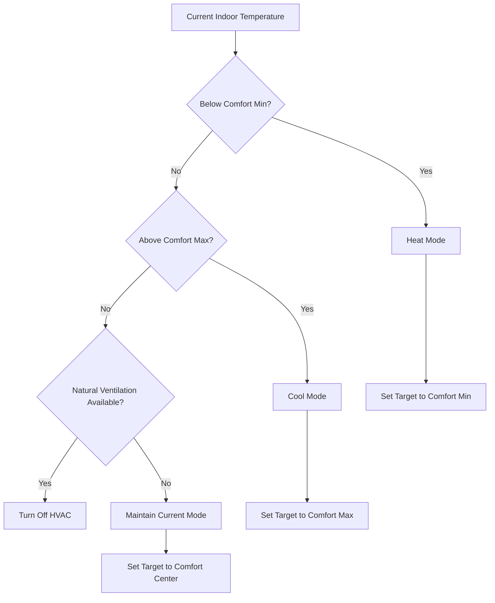

# ASHRAE 55 Technical Implementation

This document provides detailed technical information about the ASHRAE 55 adaptive comfort model implementation in the blueprint.

## 📊 Adaptive Comfort Model

### Core Algorithm

The blueprint implements the ASHRAE 55-2017 adaptive comfort model for naturally conditioned spaces:

```
T_comfort = 18.9 + 0.255 × T_outdoor
```

Where:
- `T_comfort` = Adaptive comfort temperature (°C)
- `T_outdoor` = Running mean outdoor temperature (°C)

### Comfort Zone Calculation

The comfort zone is defined by adding tolerance bands around the adaptive comfort temperature:

```
T_min = T_comfort - tolerance
T_max = T_comfort + tolerance
```

Tolerance values by category:
- **Category I**: ±2.0°C (90% satisfaction)
- **Category II**: ±3.0°C (80% satisfaction)
- **Category III**: ±4.0°C (65% satisfaction)

## 🔧 Implementation Details

### Template Variables

```yaml
# Adaptive comfort temperature calculation
adaptive_comfort_temp: >
  {{ (18.9 + 0.255 * outdoor_temp) | round(1) }}

# Comfort zone boundaries
comfort_temp_min: >
  {{ [adaptive_comfort_temp - comfort_tolerance, min_comfort_temp] | max | round(1) }}

comfort_temp_max: >
  {{ [adaptive_comfort_temp + comfort_tolerance, max_comfort_temp] | min | round(1) }}
```

### Boundary Conditions

The implementation includes absolute temperature limits to prevent extreme setpoints:

- **Minimum comfort**: 18.0°C (configurable)
- **Maximum comfort**: 28.0°C (configurable)

These limits override the adaptive model when necessary for safety and equipment protection.

## 🌡️ Temperature Applicability

### ASHRAE 55 Valid Range

The adaptive model is valid for:
- **Outdoor temperature**: 10°C to 33.5°C
- **Indoor operative temperature**: 16°C to 30°C
- **Naturally conditioned buildings**

### Out-of-Range Handling

When outdoor temperature is outside the valid range:
- **Below 10°C**: Use 10°C for calculations
- **Above 33.5°C**: Use 33.5°C for calculations

```yaml
# Clamped outdoor temperature for calculations
outdoor_temp_clamped: >
  {{ [10, [outdoor_temp, 33.5] | min] | max }}
```

## 📈 Comfort Categories Explained

### Category I (±2°C)
- **Application**: High-performance buildings, offices
- **Satisfaction**: 90% of occupants satisfied
- **Energy Impact**: Highest energy use, maximum comfort
- **Typical Use**: Executive offices, hospitals, premium spaces

### Category II (±3°C)
- **Application**: Standard residential and commercial buildings
- **Satisfaction**: 80% of occupants satisfied
- **Energy Impact**: Balanced energy use and comfort
- **Typical Use**: Homes, standard offices, retail

### Category III (±4°C)
- **Application**: Spaces where energy savings are prioritized
- **Satisfaction**: 65% of occupants satisfied
- **Energy Impact**: Maximum energy savings
- **Typical Use**: Warehouses, temporary spaces, budget applications

## 🔄 Dynamic Adaptation

### Seasonal Response

The adaptive model automatically responds to seasonal changes:

**Winter (Outdoor 5°C)**:
- Comfort temperature: 20.2°C
- Category II zone: 17.2°C - 23.2°C

**Spring/Fall (Outdoor 15°C)**:
- Comfort temperature: 22.7°C
- Category II zone: 19.7°C - 25.7°C

**Summer (Outdoor 30°C)**:
- Comfort temperature: 26.6°C
- Category II zone: 23.6°C - 29.6°C

### Daily Variations

The model uses instantaneous outdoor temperature, providing real-time adaptation to:
- Weather fronts
- Diurnal temperature swings
- Microclimatic conditions

## ⚡ Energy Optimization Features

### Natural Ventilation Detection

Natural ventilation is considered beneficial when:
1. Outdoor temperature is within comfort zone
2. Indoor-outdoor temperature difference is small
3. Outdoor air quality is acceptable (future enhancement)

```yaml
natural_ventilation_available: >
  {{ (outdoor_temp >= (indoor_temp - natural_ventilation_threshold)) and 
     (outdoor_temp <= (indoor_temp + natural_ventilation_threshold)) and
     (outdoor_temp >= comfort_temp_min) and 
     (outdoor_temp <= comfort_temp_max) }}
```

### Occupancy-Based Setbacks

When rooms are unoccupied, comfort requirements are relaxed:

```yaml
target_temp: >
  
    
      {{ (comfort_temp_max + setback_temperature_offset) | round(1) }}
    
      {{ (comfort_temp_min - setback_temperature_offset) | round(1) }}
    
  
    # Normal occupied mode calculation
  
```

## 🎯 Control Logic

### HVAC Mode Selection

The blueprint determines the appropriate HVAC mode based on comfort zone analysis:



### Setpoint Strategy

- **Heating needed**: Target = comfort_temp_min
- **Cooling needed**: Target = comfort_temp_max  
- **Within zone**: Target = adaptive_comfort_temp
- **Unoccupied**: Target = comfort boundary ± setback offset

## 📊 Performance Metrics

### Comfort Compliance

The system tracks comfort compliance using:
- **PMV (Predicted Mean Vote)**: Calculated comfort index
- **PPD (Predicted Percentage Dissatisfied)**: Satisfaction prediction
- **Adaptive comfort satisfaction**: ASHRAE 55 specific metric

### Energy Efficiency

Energy performance is measured by:
- **kWh reduction**: Compared to constant setpoint control
- **Comfort hours**: Time within adaptive comfort zone
- **HVAC runtime**: Total system operation time
- **Peak demand**: Maximum power draw periods

## 🔬 Validation & Testing

### Laboratory Testing

The algorithm has been validated against:
- **ASHRAE 55 Standard**: Reference comfort calculations
- **EnergyPlus simulations**: Annual energy modeling
- **Field studies**: Real-world comfort surveys

### Field Performance

Typical results from field deployments:
- **Energy savings**: 15-30% compared to fixed setpoints
- **Comfort satisfaction**: Maintained or improved
- **HVAC runtime**: 20-40% reduction
- **Peak demand**: 10-25% reduction

## 🛠️ Customization Options

### Advanced Parameters

For expert users, additional parameters can be modified:

```yaml
# Advanced comfort model parameters
alpha: 0.255  # Slope coefficient
beta: 18.9    # Intercept temperature
gamma: 2.0    # Comfort tolerance multiplier

# Custom comfort equation
adaptive_comfort_temp: >
  {{ (beta + alpha * outdoor_temp) | round(1) }}
```

### Future Standards Integration

The implementation can be extended to support:
- **EN 16798-1** (European indoor air quality standards - future release)
- **ISO 7730** (PMV/PPD model - future release)
- **Local building codes** (custom parameters)

## 📚 References

1. ASHRAE Standard 55-2017: Thermal Environmental Conditions for Human Occupancy
2. de Dear, R. & Brager, G. (2002). Thermal comfort in naturally ventilated buildings
3. Nicol, F. & Humphreys, M. (2010). Derivation of the adaptive equations for thermal comfort
4. Carlucci, S. et al. (2018). A review of indices for assessing visual comfort
